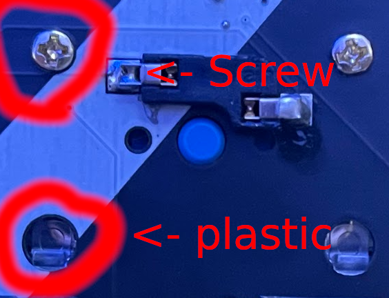
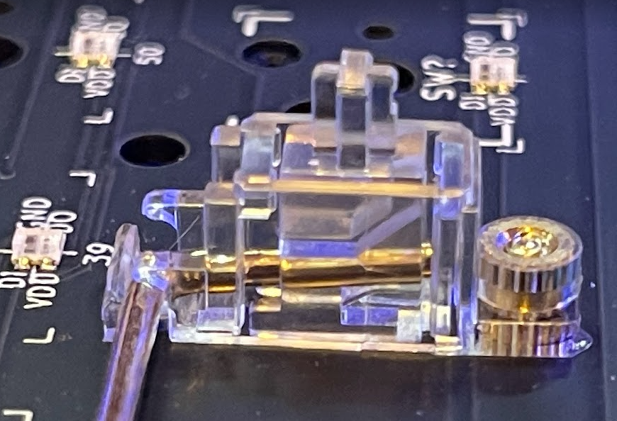
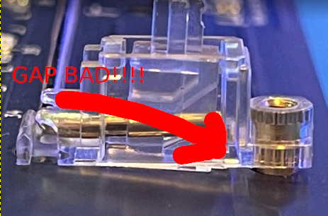

# Step 1 : Placing the Stabilizers

## Supplies
1. Circuit board
2. Stabalizers
3. Screw driver;  one Phillips and one flat

## Steps
1. You'll place 5x stabilizers
2. Plastic piece goes into the bigger hole
3. Brass piece goes into the smaller hole
4. A screw secures

## Things to check
1. the plastic *MUST* be very tight - *NO GAPS*
2. tighten the screws all the way - dont crush the circuit board, but make it very tight

*GOOD :*
Note that the stabalizer is flush to the board - it's VERY important that there is no gap between the stab and the PCB

You should be able to feel the plastic tab - it should be very obviously above the circuit

*BAD:*
This gap is very bad - it'll mean you have to take the keyboard apart later

## Once Assembled
1. Give it to your buddy
    * Make certain the plastic tab is locked on the PCB 
    * Make certain there is no gap between the stab
    
 2. Once you and your buddy are both finshed go to the Supplies Station for Step 2!!!
 