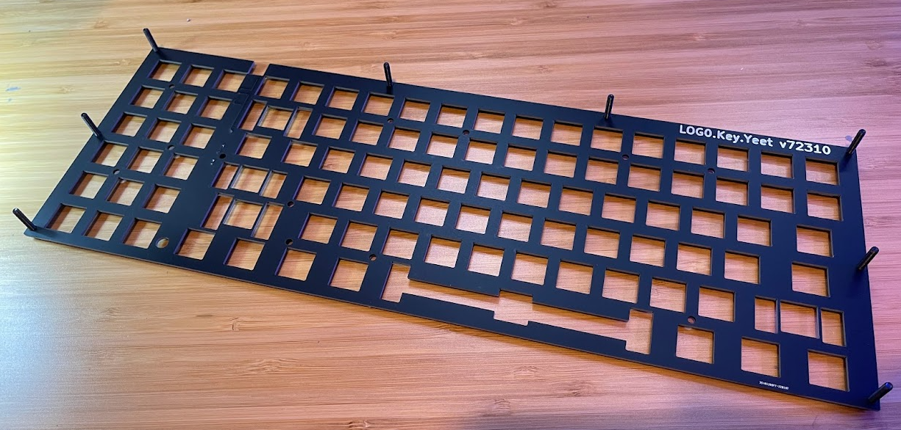
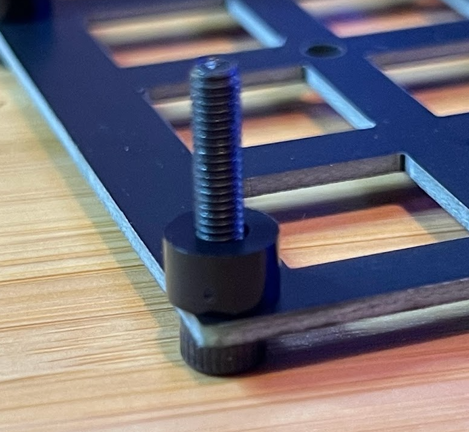
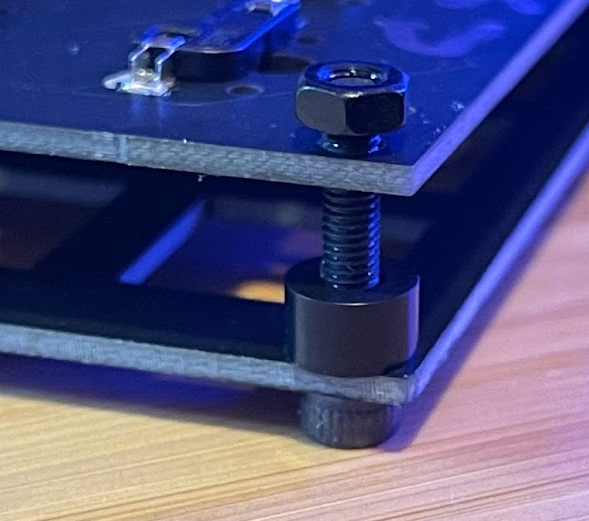
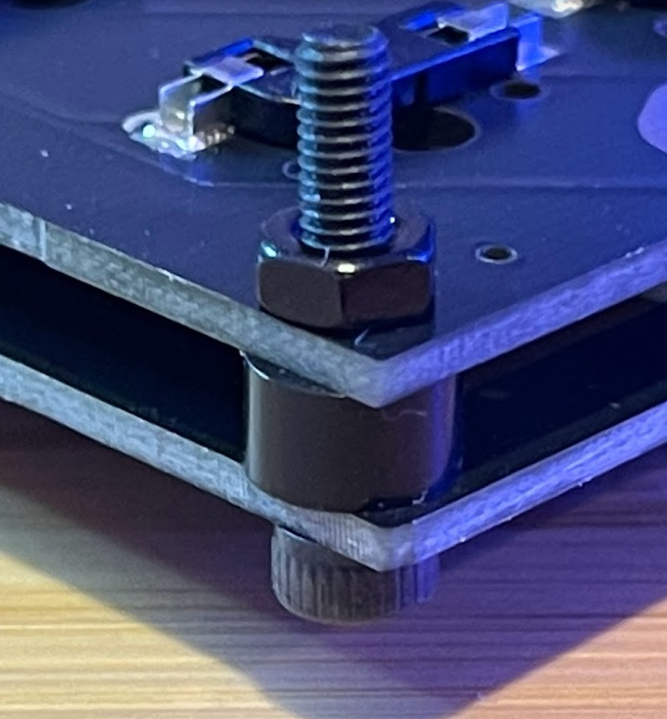

# Step 2
In this step you're going to connect the top plate and the circuit board

## Supplies
1. 8x 12mm screws
2. 8x nuts
3. 8x plastic spacers

## Steps
1. Turn the top plate upside make sure you can read "Log0.Key.Yeet" 

2. place the bolts through the top plate

3. place plastic washers

4. place the circuit board 

5. lightly tighten one nut on each bolt just enough so it doesn slip

6. once 8x nuts are lightly tighten - fully tighten the nuts

## Once Assembled
1. Give it to your buddy
    * Make certain 8x screws are tight
    * Make sure each looks like the picture above
    
 2. Once you and your buddy are both finished go to the Supplies Station for Step 3!!!
 