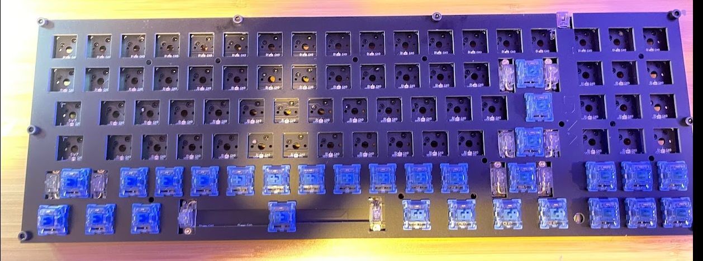
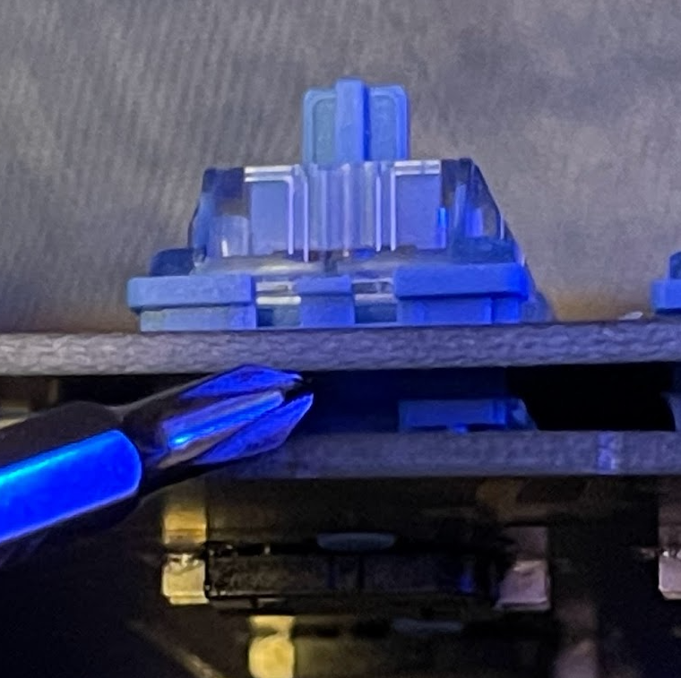
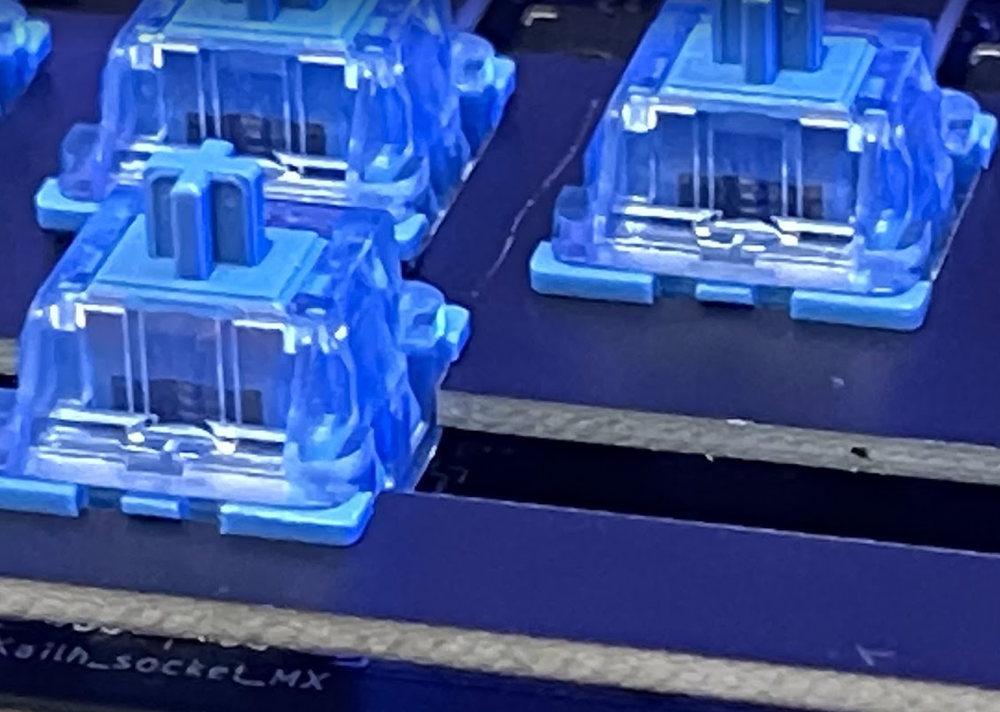

# Step 3
In this step you're going to place just enough keys to gain confidence that you're applying them correctly

## Supplies
1. Box of keys

## Steps
1. Apply the keys as you see in the picture

2. Make sure all the keys are fully secured and flush to the top of the circuit

3. Make sure each key is flush

## Once Assembled
1. Give it to your buddy
    * Make certain each key is flush with the circuit board
    * Make sure each looks like the picture above
    
 2. Once you and your buddy are both finished go to the Supplies Station for Step 4!!!
 